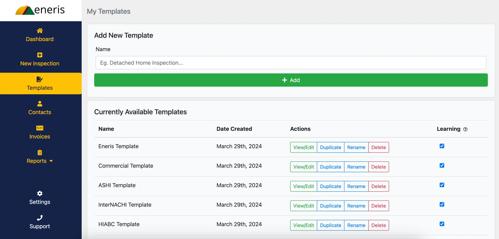
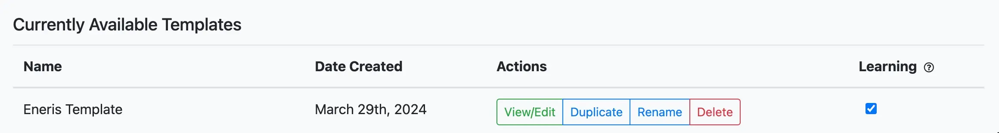
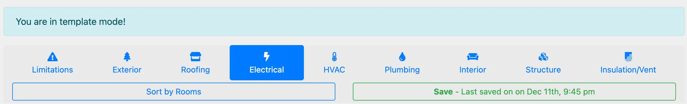
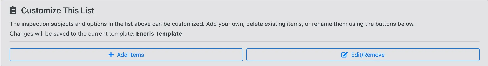
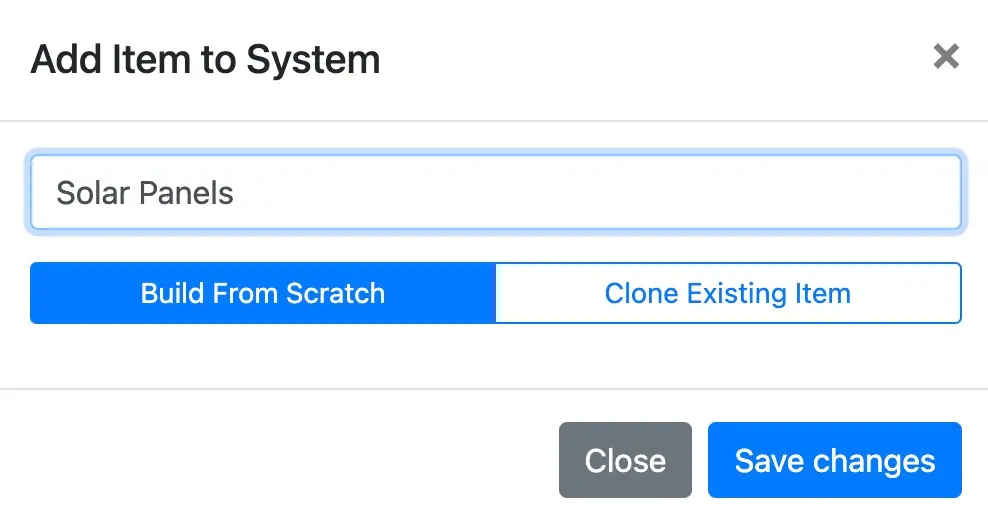
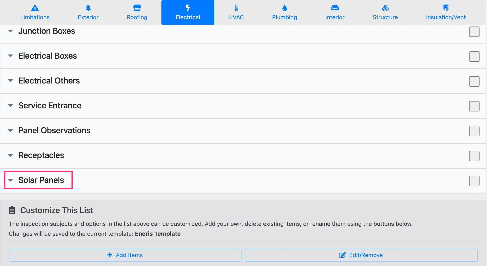
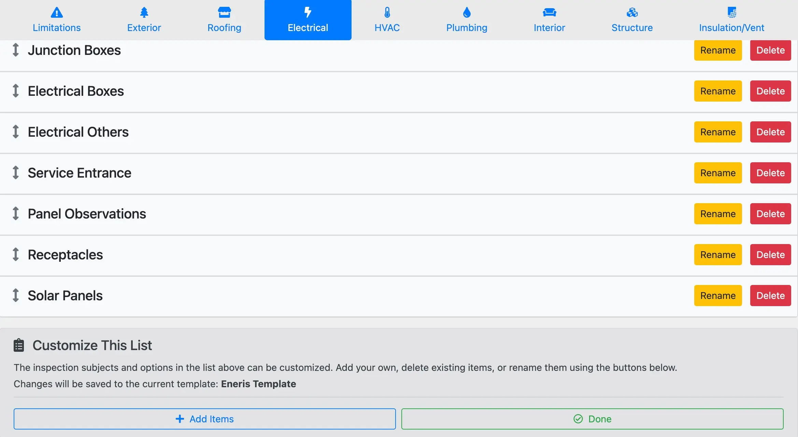
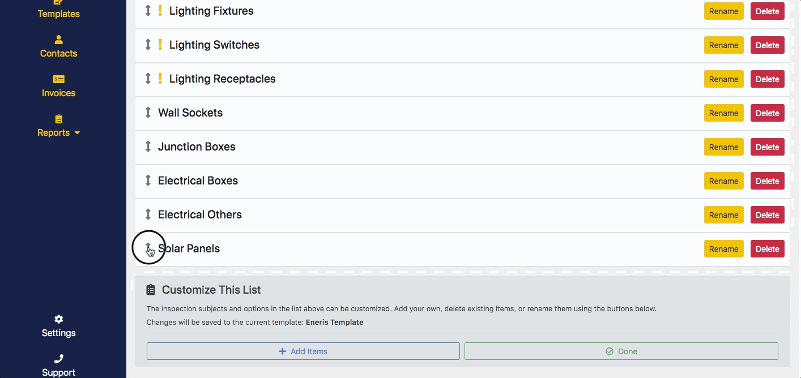

# Templates

Templates allow for the customization of inspection lists, and the pre-filling of report fields. Once saved, they are available for selection when creating a new report, and in any report's `General` ****tab.

Templates are critical to an efficient inspection workflow on-site. Eneris allows for easy customization of templates and includes the most commonly used templates in US and Canadian markets to help you get started quickly.

Clicking the `Merge Template` button in any report's **General** tab will update the template with any updates made since the report was created, but will not overwrite report data.

## Default inspection templates

The following default inspection templates are available in Eneris:

### General

- Eneris template
    - A custom template developed by Eneris that incorporates the best parts of the ASHI, InterNACHI, HIABC, and ASTTBC inspection templates.

### Commercial inspections

- Commercial template

### Associations

- American Society of Home Inspectors (ASHI) template
- International Association of Certified Home Inspectors (InterNACHI) template
- Home Inspectors Association BC (HIABC) template
- Applied Science Technologists & Technicians of BC (ASTTBC) template
- American Home Inspectors Training (AHIT) template

### Supplementary reports

- Florida - 4-Point Inspection Template
- Florida - Wind Mitigation Template
- Texas - TREC REI 7-6 Template

## Review included templates

1. Select `Templates` on the left-hand sidebar.

2. As seen above, Eneris includes a wide range of ready to use residential and commercial property inspection templates. These templates were created after careful consideration of the Standards of Practice (SOP) for various regions.
    - **Eneris Template** blends required items from major property inspection associations in North America to produce a coherent template with great coverage on the most common subjects encountered during an inspection.
    - **ASHI Template** corresponds to the [American Society of Home Inspectors SOP](https://www.homeinspector.org/Resources/Standard-of-Practice).
    - **InterNACHI** **Template** corresponds to the [International Association of Certified Home Inspectors SOP](https://www.nachi.org/sop.htm).
    - **AHIT Template** corresponds to paper forms that were traditionally used by inspectors trained by AHIT.
    - **4-Point** **Inspection Template** can be used to conduct insurance inspections for Roofing, Electrical, Plumbing, and HVAC.
    - **Commercial Template** corresponds to the [Certified Commercial Property Inspectors Association (CCPIA) SOP](https://ccpia.org/standards-of-practice/).
    - [HIABC](https://hiabc.ca/wp-content/uploads/2018/08/HIABC-Scope-of-Inspection.pdf) and [ASTTBC](https://asttbc.org/wp-content/uploads/2021/10/2016-Standards-of-Inspection.pdf) correspond to their respective associations in the province of British Columbia, Canada.

## Add new items to a template

We recommend starting with a pre-loaded template and customizing it for your needs.

1. Select `View/Edit` button beside any template.

2. Select the system that needs an additional item. e.g., **Electrical**.    

3. Scroll to the bottom of the item list to locate the `Customize This List` menu. There are options for adding, editing, and removing items.
4. Select `+ Add Items`.

5. An option box will appear requesting the name of the new item to add, and whether the contents and pre-loaded narratives inside the item should be left empty, or copied from another item. For this example, the new item will be named “Solar Panels" and built from scratch.
    

    
6. The newly created "Solar Panels" item inside the Electrical section is now seen at the bottom of the list.

    

## Reordering, renaming, or removing items

To change the order of any item in the list:

1. Select the `Edit/Remove` button at the bottom of the page within the `Customize This List` menu. All items in the list will now display an up/down  arrow (⬍), a `Rename` button, and a `Delete` button.

2. Select and hold to drag the **⬍** arrow icon upwards to move the item up the list. Release the mouse button to drop the item into its new location on the list.

## Pre-load text, graphics, and/or diagrams into templates

Expanding into an inspection subject while in template customization mode allows for the entry of text, photos, and videos. Any information or media entered in an inspection subject during this time will always be shown in any future reports created using that template unless manually removed.