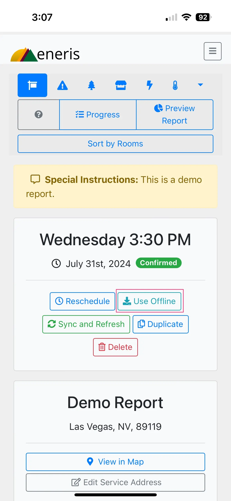
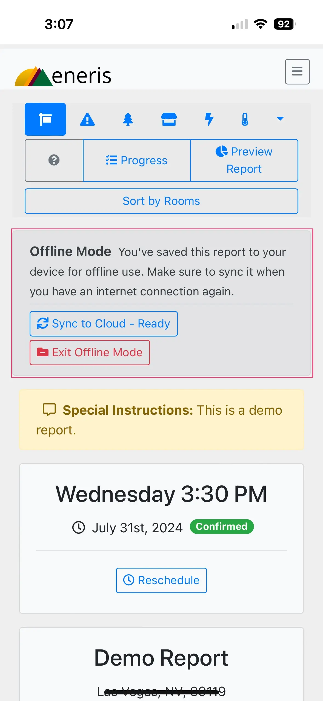
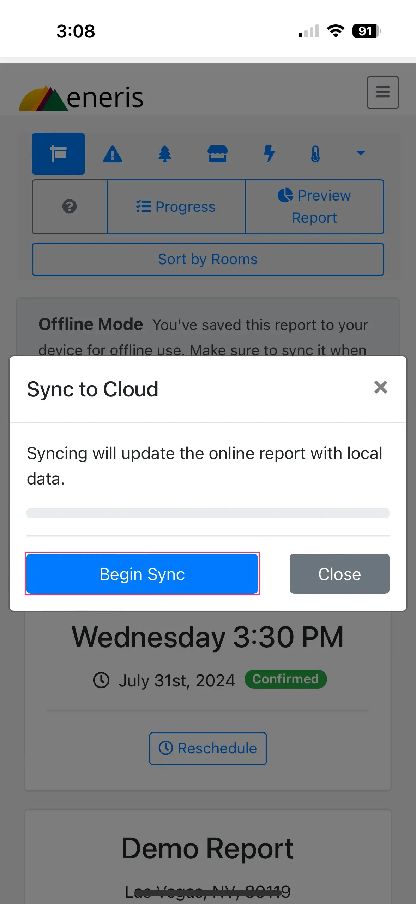
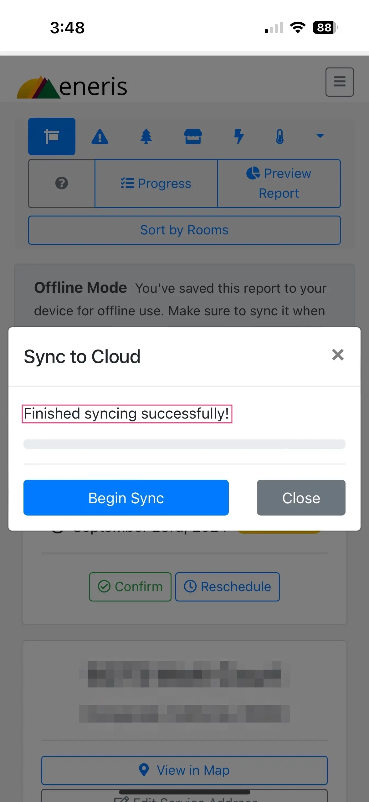
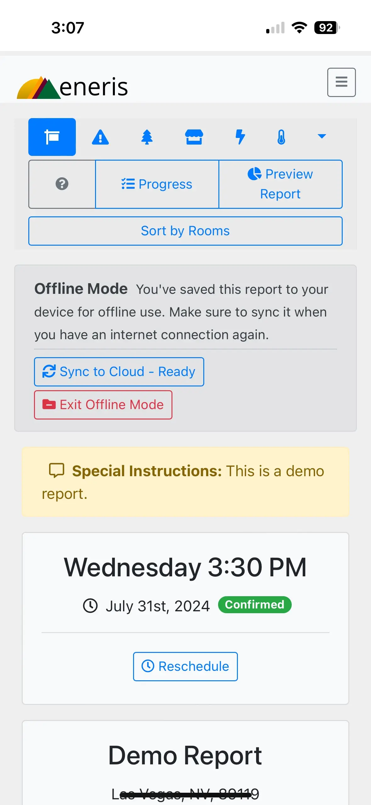
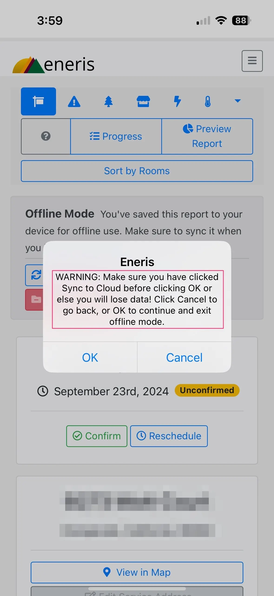
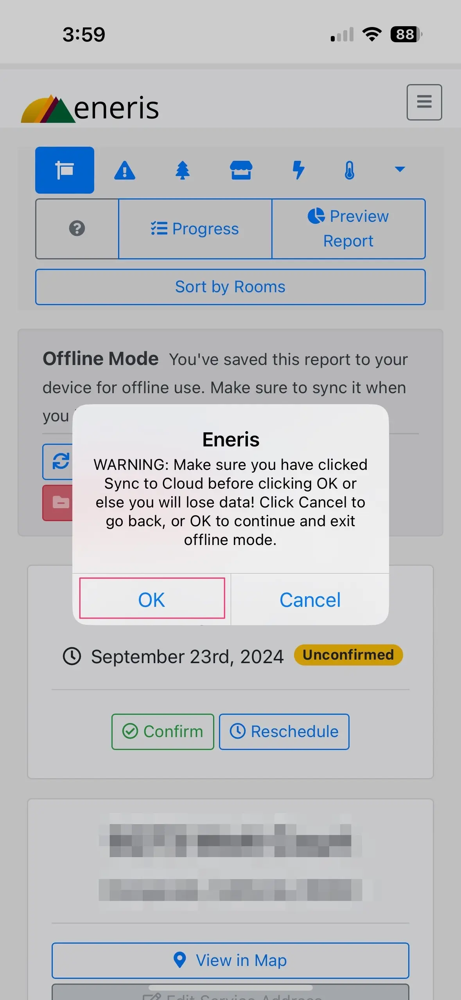
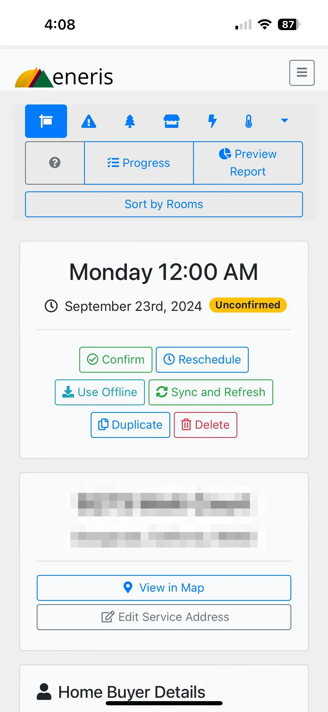

# Offline mode

The Eneris iOS and Android Apps include an **Offline Mode**, which enables you to fully complete your inspection report without internet connection. It can then be synced to the cloud, once you have access to the internet again, before you share the completed report with your client. This is a great option if the inspection is in a rural area or in an area with no internet connection.

- Offline Mode works the same way on both iOS and Android devices.
- An internet connection is only necessary when you are ready to sync your report to the cloud.

## How to enable Offline Mode

1. Create a new inspection or select the inspection you would like to perform in Offline Mode.
2. At the top of the **General** page select the **Use Offline** button.

3. A new menu section will appear once you have successfully entered Offline Mode.

## Syncing reports in Offline Mode

When in Offline Mode, the report and all of its contents are automatically saved to your mobile device storage. To ensure your work is backed up and saved online you must sync your offline report to the cloud.

Follow these simple steps:

1. Find an area with cellular reception or wifi connection.
    - Depending on your inspection, this may be when you are in a certain area of the property or back at your own office.
2. Navigate to the **General** page of the inspection.
3. Select **Sync to Cloud - Ready**.

4. Select **Begin Sync**.

5. A successful sync will show the following message.

## How to re-enable Online Mode

Online Mode is required to generate the finalized inspection report. Follow these steps to re-enable Online Mode.

1. Find an area with strong cellular or wifi connection.
    - Depending on your inspection, this may be when you are back at your office or in a certain area of the property.
2. Navigate to the **General** page of the inspection.
3. Select **Exit Offline Mode**.

4. A pop-up menu will appear reminding you to sync your report prior to Exiting Offline Mode. **Please complete this step (see instructions in the section above) to ensure the latest version of your report is saved.**

5. Select **OK**.

6. Eneris will refresh and the Offline Mode menu will disappear. Online Mode has successfully been enabled.

## Video guide

This [short video](https://www.youtube.com/embed/GjzDBKn8BGA) provides an overview of the Offline Mode feature.