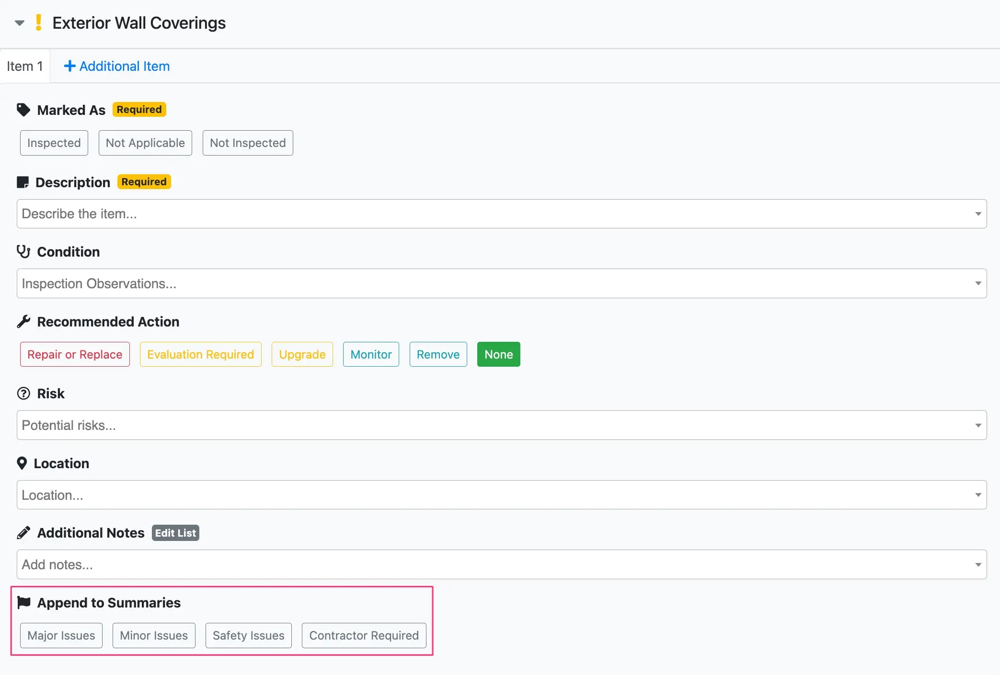
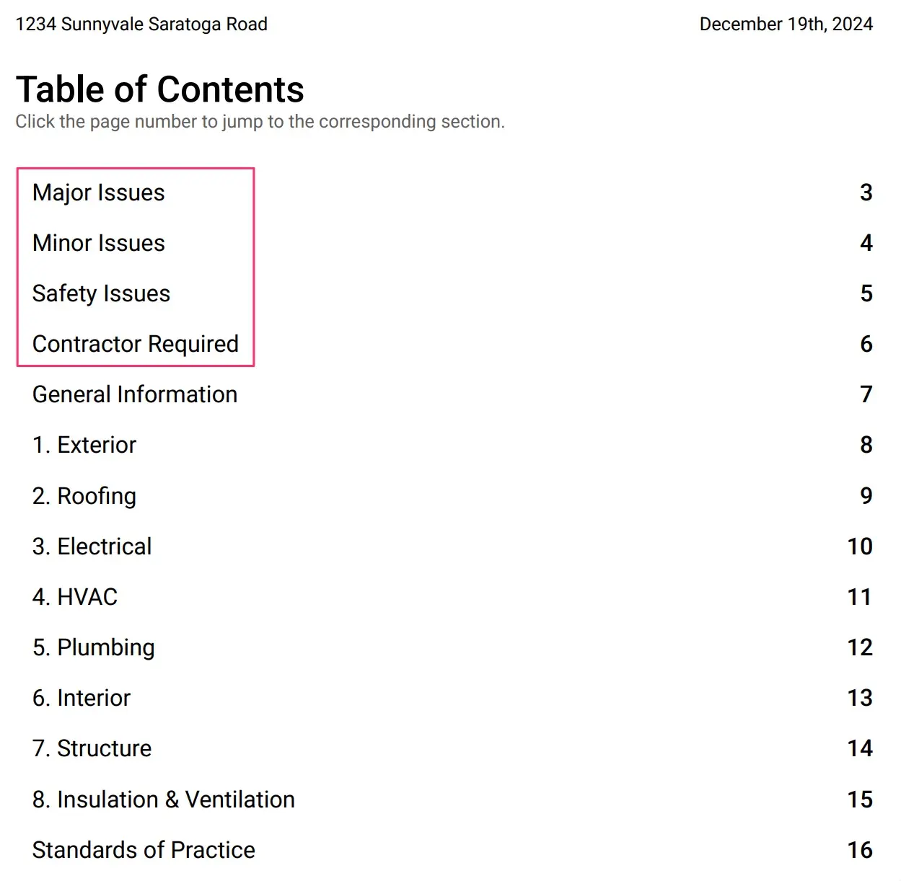
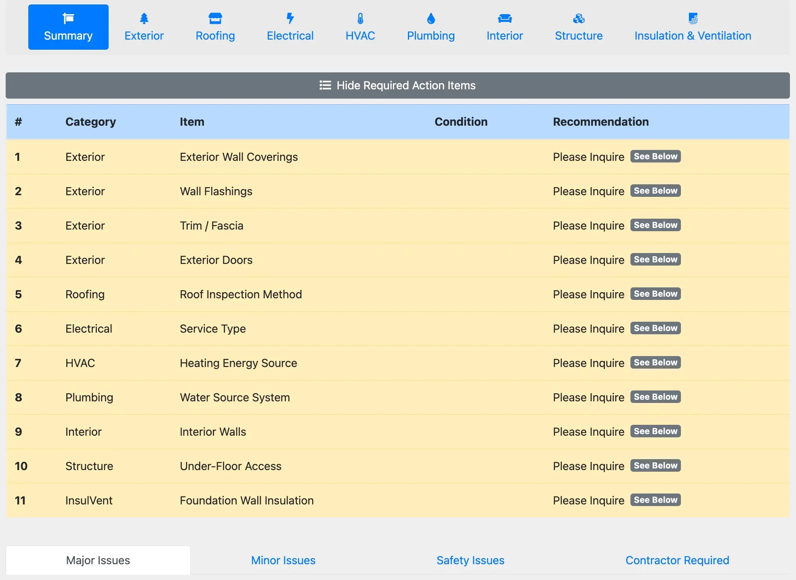
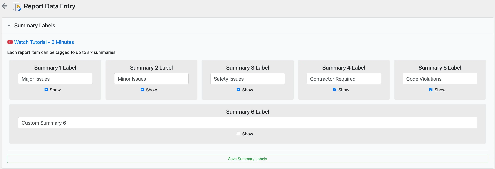

# Summary labels

Summary labels enable the ability to highlight key items from your inspection to the top of the report. The text in the labels are fully customizable.

:::info[Info]

Here is a [3 minute summary video](https://www.youtube.com/watch?v=ME4ztzQzRps) of the feature.

:::

## Using summary labels

Summary labels are used during the writing of an inspection report and the resulting highlighted sections are visible in PDF reports and web reports.

### Writing inspection reports

Summary labels can be found in the `Append to Summaries` section **while writing the inspection report.**

### PDF reports

Summary labels can be found **above** the `General Information` section in the `Table of Contents` in the **PDF report.** A brief description of the highlighted items will appear here. Full details of the highlighted items can be found in their respective systems in the PDF report.

### Web reports

Summary labels can be found in the `Summary` section in the **Web report**. A brief description of the highlighted items will appear here. Full details of the highlighted items can be found in their respective systems in the web report.

## Summary label setup

Follow the steps below to customize your summary labels:

1. Navigate to `Settings`.
2. Select `Report Data Entry`.
3. Expand the `Summary Labels` menu.
4. There are a total of six summary labels to customize and enable/disable, as desired.
5. Select `Save Summary Labels` after completing your changes.
6. Inspection reports created from this point onward will now use the updated summary labels.

