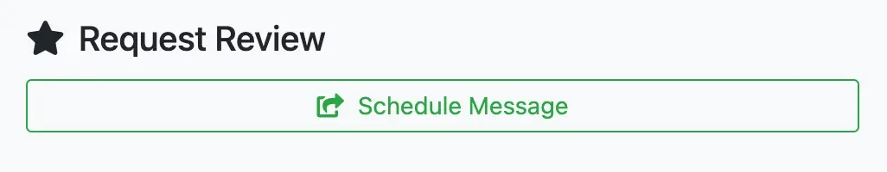
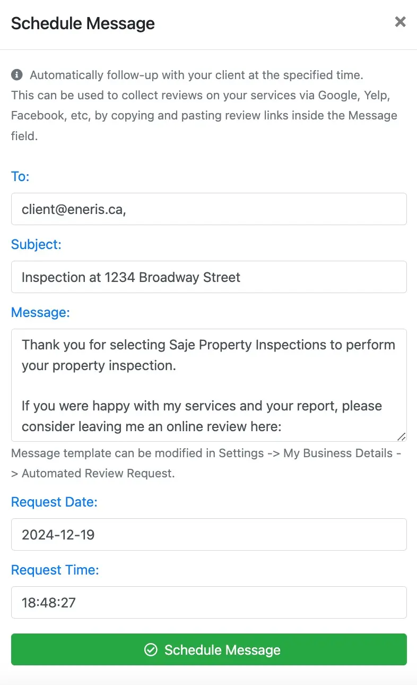
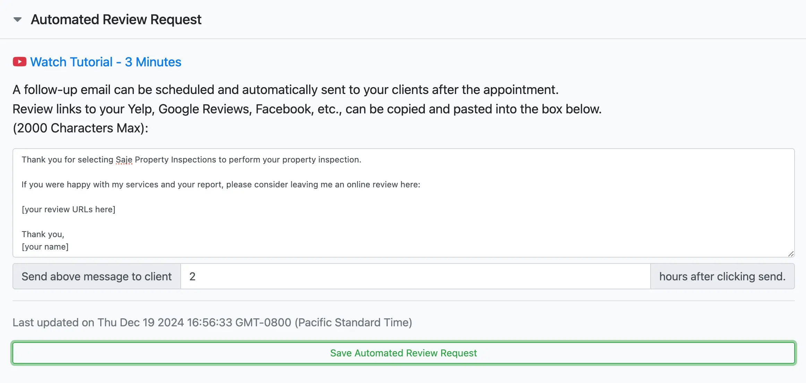

# Client reviews

Automatically follow-up with your client at a specified time after the inspection has been completed. This can be used to collect reviews on your services via Google, Yelp, Facebook, etc, by copying and pasting review links inside the Message field.

## Request Review

1. Navigate to the inspection.
2. Scroll to the bottom of the `General` tab.
3. Select `Schedule Message` located under the `Request Review` section.

4. The `To` and `Subject` fields will automatically populate based on the inspection information.
5. Input the contents of your message in the `Message` field.
6. Input the date and time you wish the message to be delivered in the `Request Date` and `Request Time` fields, respectively.

## Message Template for Request Review

A message template can be saved if the follow-up emails are the same for every inspection. 

To set this up:

1. Navigate to the settings menu.
2. Select `My Business Details`.
3. Select `Automated Review Request`.
4. Input custom text you would like sent to every client after completing the inspection (2,000 characters max).
5. Input the default number of hours that should pass after the inspection before this message is sent.
6. Select `Save Automated Review Request`.
7. This template will now be used each time the `Request Review` feature is used.

