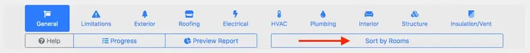
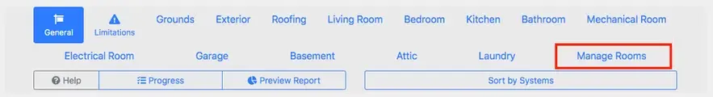
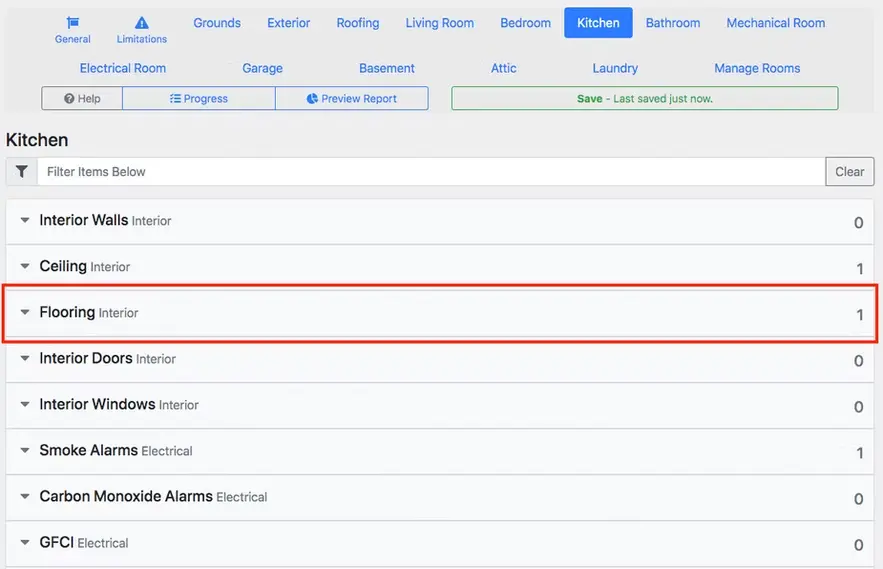
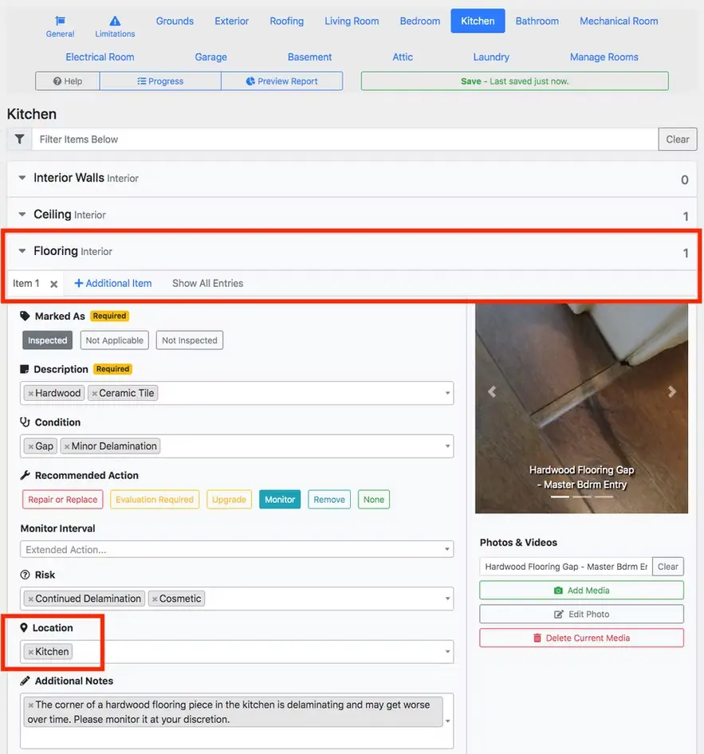
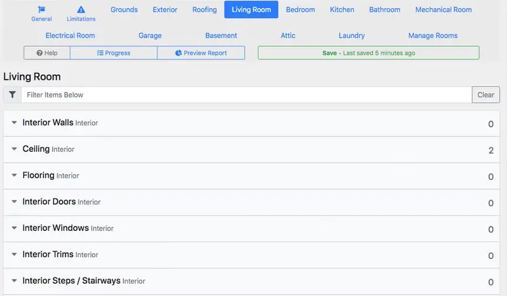
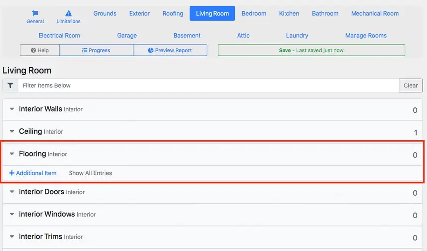
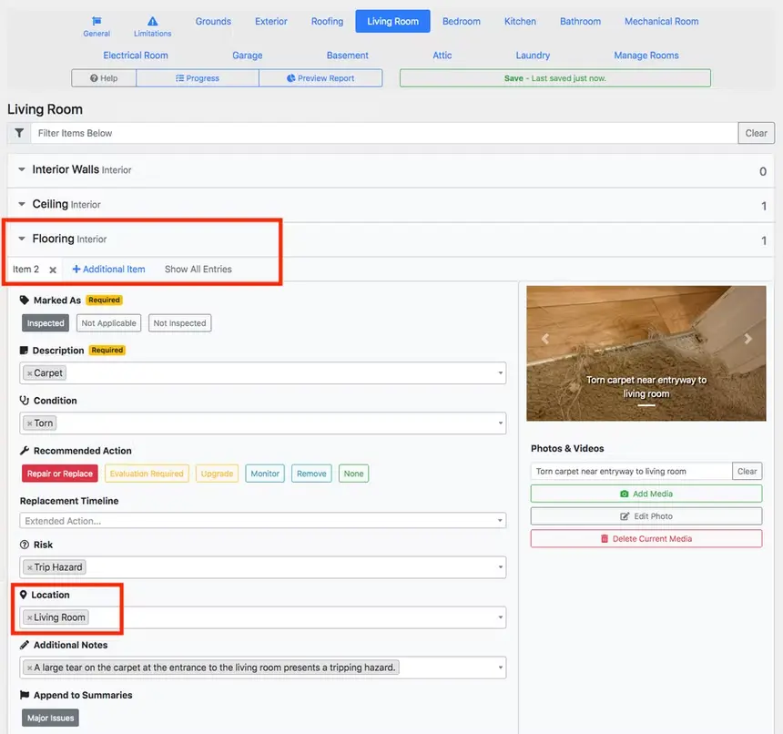
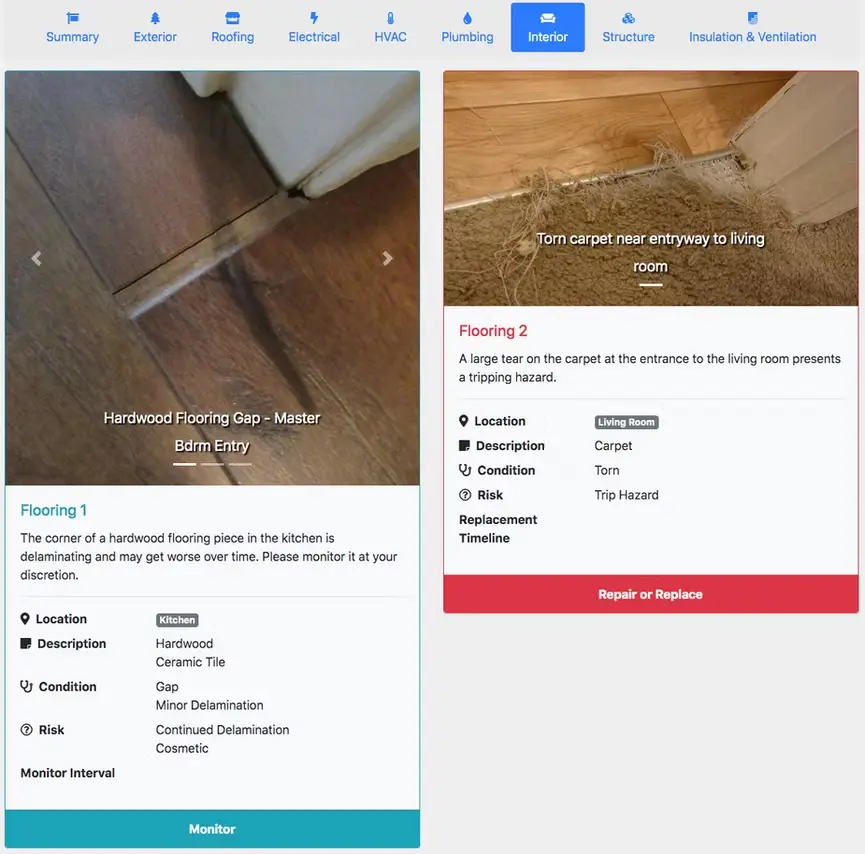
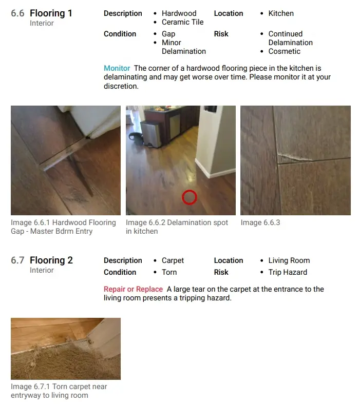

# Room-by-room inspection

If an inspector wishes to inspect a property on a room-by-room basis they may wish to enable **Room-by-Room** mode instead of inspecting the property by system.

In the following example, we will consider the case in which a home inspector wishes to inspect the kitchen, followed by the living room. In both rooms, the home inspector finds issues with the flooring and wants to add report data for each observation.

## Switch to Room-by-Room mode

Select the `Sort by Rooms` option and observe the menu switch to show rooms instead of systems.

The `Manage Rooms` button can optionally be clicked to configure rooms and their ordering.

## Add report data to first room

Click the `Flooring` item to expand it and add more observations.

The *interior* label to the right of `Flooring` specifies that this item belongs to the *interior* system of the home, and will be shown under **Interior** in the final web and PDF reports.

When expanded, a series of labels are shown as surrounded by the red box below.

- `Item 1` is a *tab* specifying the first item to note to the client with regards to `Flooring` as a part of the property's **Interior** system.
- `+ Additional Item` will add a new tab in which more information on a different issue can be entered, while still linking back to `Flooring`.
    - Items play an important role in adding findings from each room to the **Interior -> Flooring** section.
- `Location` will automatically be filled in with the room that is currently being inspected.

## Add report data to second room

As mentioned above, a notable issue was found regarding the `Flooring` in the `Living Room`. Selecting `Living Room` shows items typically inspected in that room.

The `Flooring` subject currently has 0 entries in the `Living Room`, as noted by the 0 to the right of the subject. Clicking `+ Additional Item` will add a new Item.

After clicking `+ Additional Item`, `Item 2` has been created with **Living Room** automatically entered in the `Location` box.

## Report view from a client’s perspective

The issues observed with Flooring are shown in the Web and PDF reports in a manner that clearly conveys each detail to your client.

