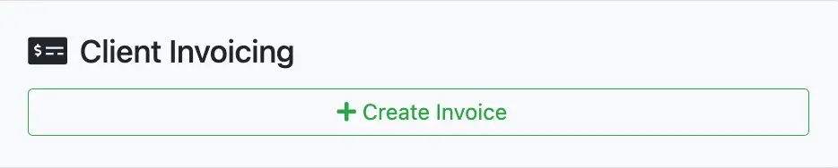
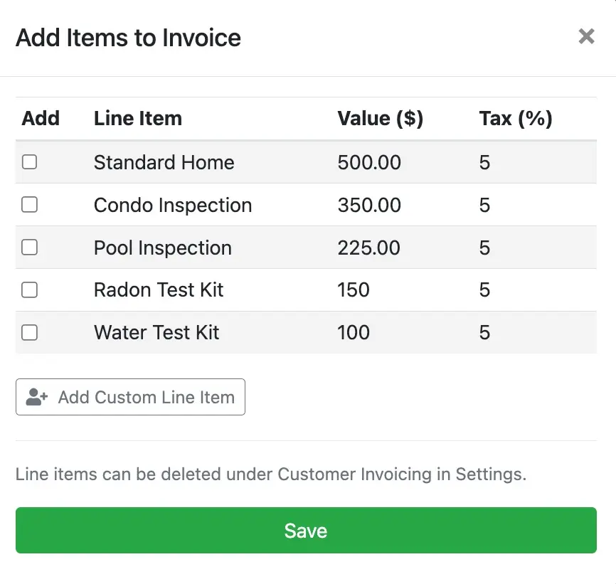
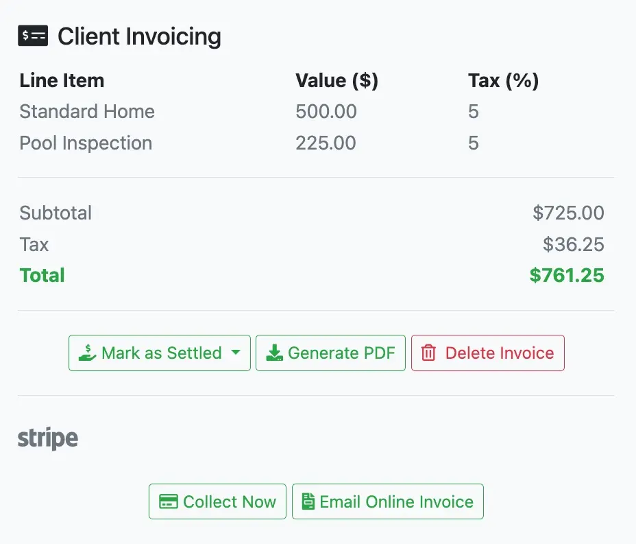
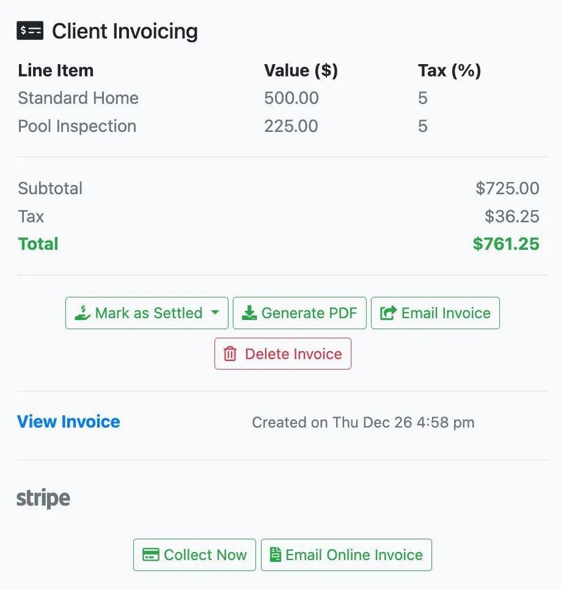
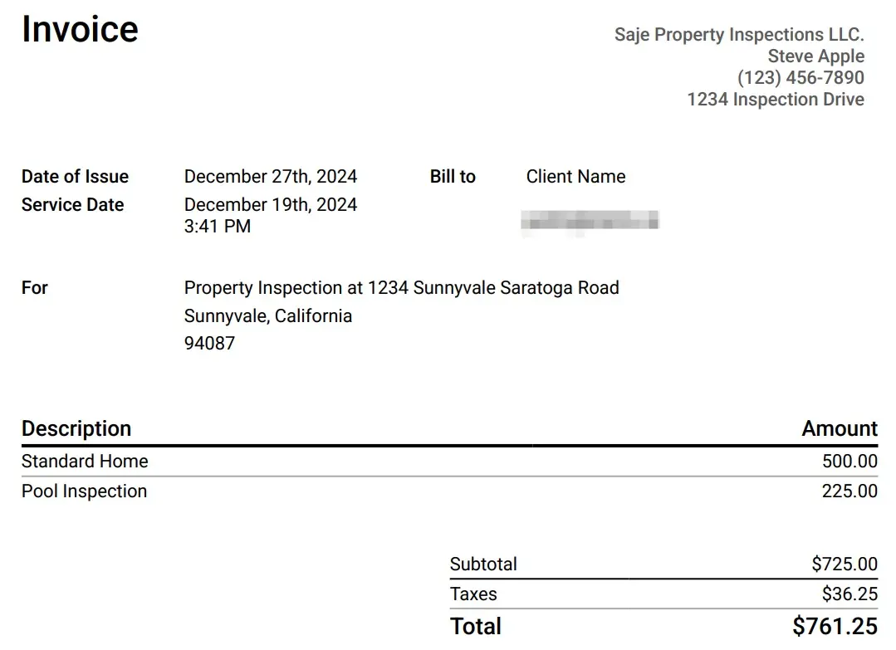
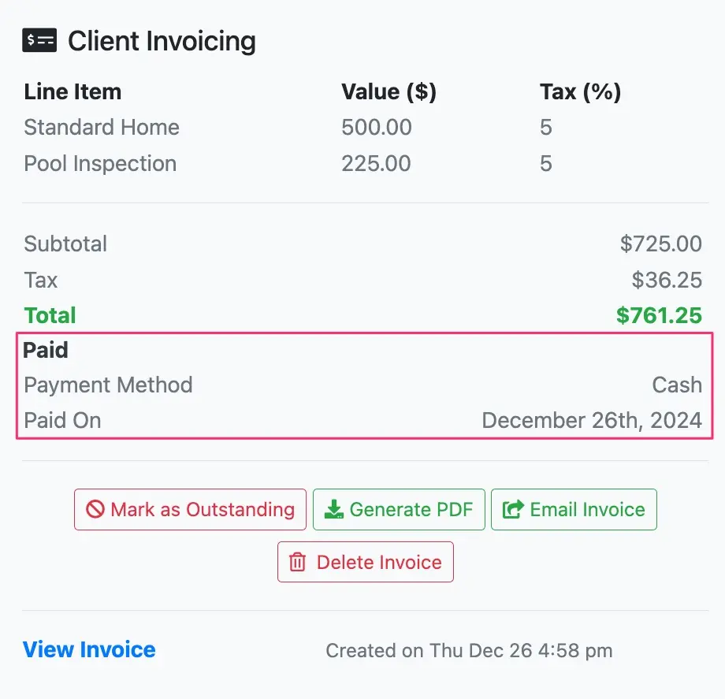
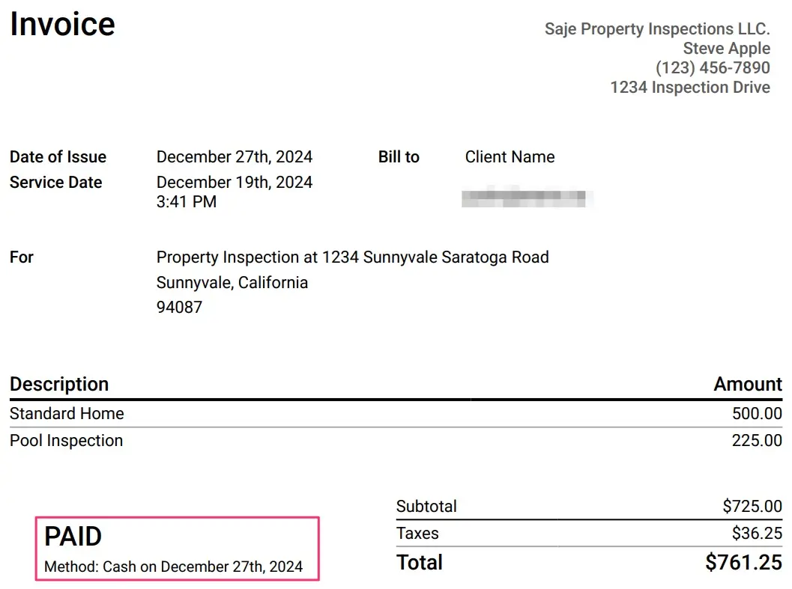

# Client invoicing

Invoices can be easily generated, shared, and marked as paid within Eneris.

## Generating invoices

1. Navigate into the desired inspection.
2. In the **General** page scroll down to the `Client Invoicing` section.
3. Select `+ Create Invoice`.

4. Select the relevant line items.
    - Select `Add Custom Line Item` if a new line item needs to be created. After filling in the info, select the blue `+` button to finalize adding the custom line item.
        - This new line item will be saved as a selectable option for future inspections.

5. Select `Save`.
6. The selections will now reflect in the `Client Invoicing` section.
    - If you have connected your Stripe account to Eneris to accept online payments you may use the `Collect Now` and/or the `Email Online Invoice` options at the bottom.
    - If you have not connected your Stripe account to Eneris, continue with the steps below.

7. Select `Generate PDF` .
8. Select `View Invoice` to review the PDF invoice that was generated.

## Sharing invoices

After an invoice has been created, select `Email Invoice` to send the invoice to the client and any additional secondary contact.

## Marking invoices as paid

1. Select `Mark as Settled` and choose the appropriate payment method once the invoice has been paid. The `Client Invoicing` section will automatically update with the selection.

2. Select `Generate PDF` again to include the payment method and date on the PDF invoice.

