# Collect payments

Eneris has an integration with Stripe to provide inspectors with a secure end-to-end payment platform. You can quickly and easily accept online payments from your clients with minimal credit card processing fees.

To enable this feature, see the setup guide below.

## Connect Eneris with Stripe

1. Navigate to `Settings`.
2. Select the `Invoicing & Collection` submenu.
3. Select the `Connect with Stripe` button.

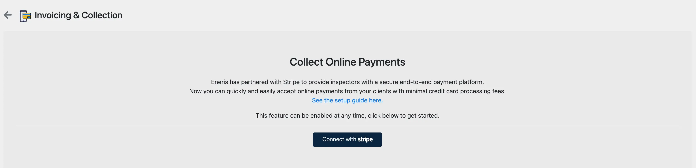

4. A new page will be shown to begin setup with Stripe, which will prompt you to create an account.

:::info[Info]

Please ensure that you use the email address and contact information associated with your business when creating this account.

:::

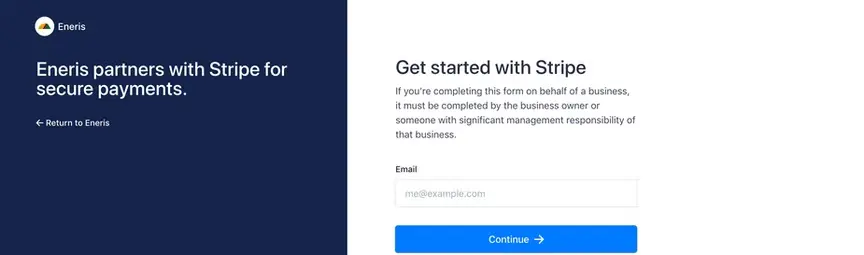

5. Continue adding the required information as it relates to your business.

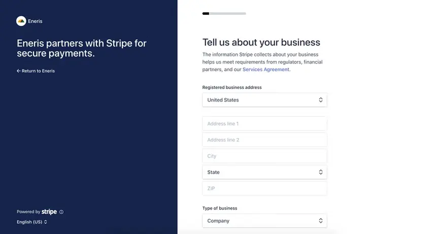

6. More information will be asked in the steps that follow. It is important to have any applicable business tax IDs, and banking information for deposits ready to ensure a successful setup.
7. Stripe allows for the customization of the statement descriptor that your clients will see on their credit card statements, as well as a support number that will be listed on the invoice. This should be your business phone number.

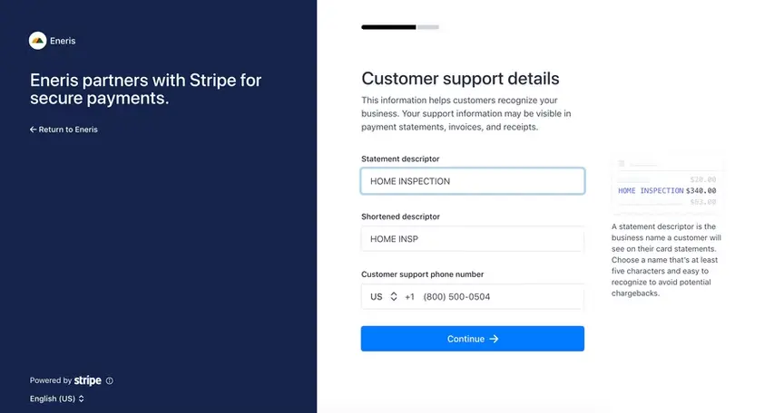

8. Finally, review your details and make and last-minute changes. Stripe will provide warnings for fields that were missed or require more information.

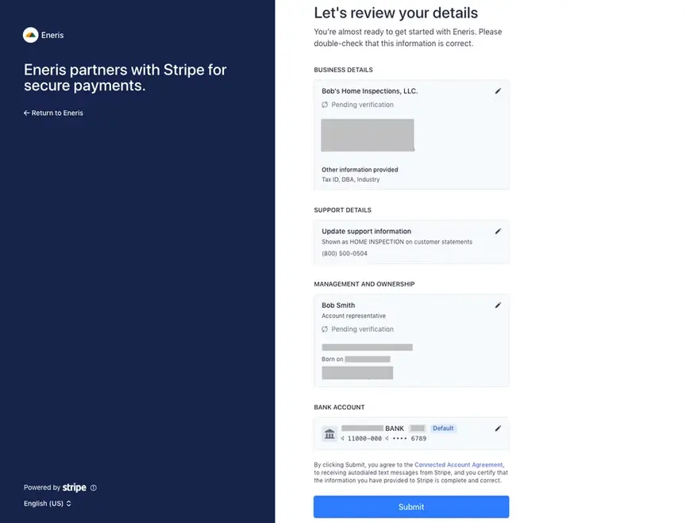

9. You'll be redirected back to the Eneris dashboard once you've completed your Stripe account setup. Please ensure to check your email inbox to finish verifying your details with Stripe.

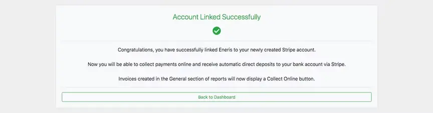

## Customize invoices & branding

Following a successful connection between Eneris and Stripe, a link to your Stripe Dashboard will be available in Settings. Select the **Go to Stripe Dashboard** button to log-in to your account with the username and password you had created in the **Connect Eneris with Stripe** section above.

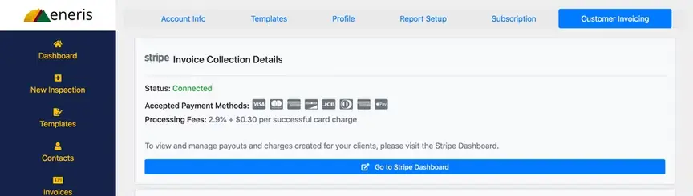

At first glance, you'll see a dashboard which will provide you with insights into your business performance over time.

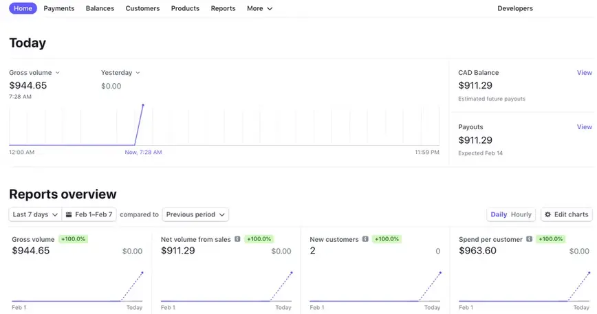

In Stripe, navigating to **Settings → Business → Branding** allows you to customize your logos and icons across both online invoices and invoice PDFs.

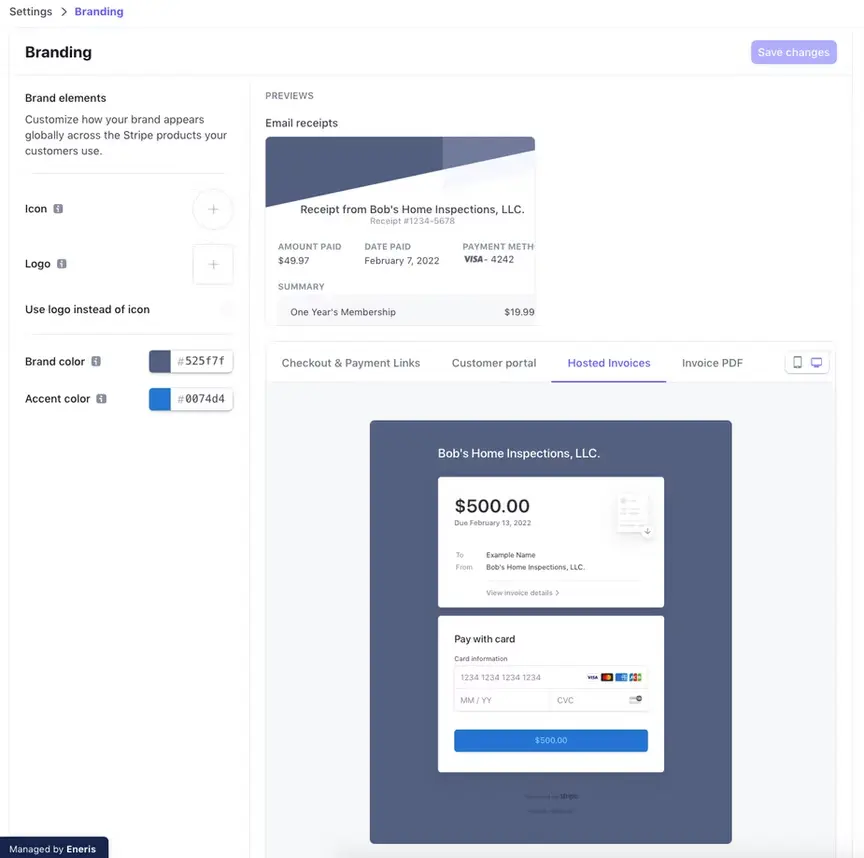

## Collect payments

Any invoice created in Eneris can be collected in one click: either on-site or via an email sent to your client before or after the inspection.

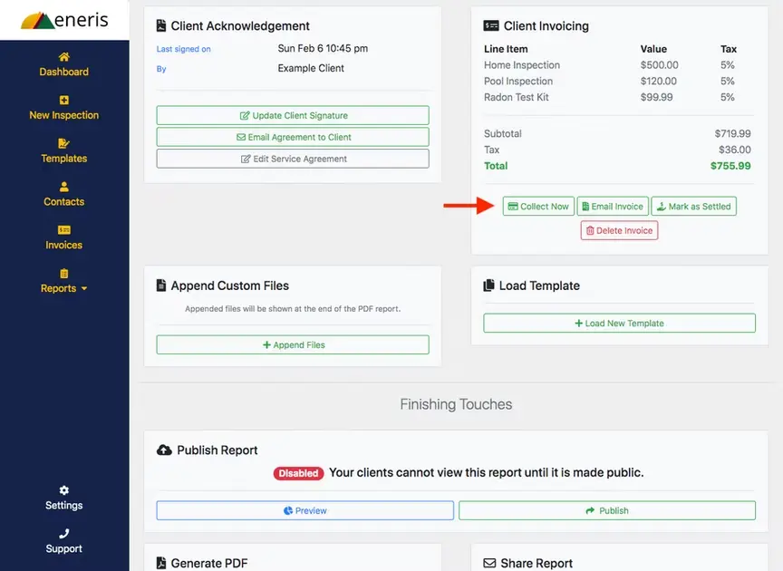

Example of the invoice PDF sent to your client via email:

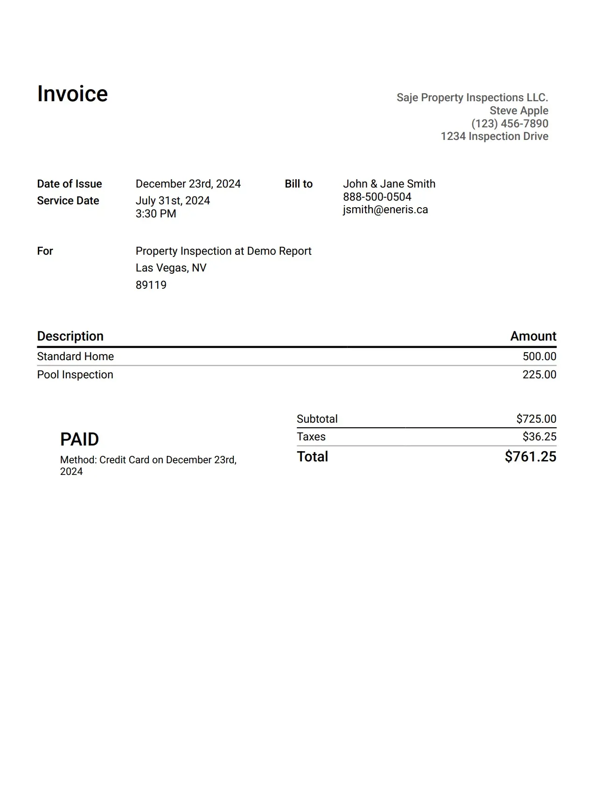

Example of the **Online Payment Portal** and the **Collect Now** page:

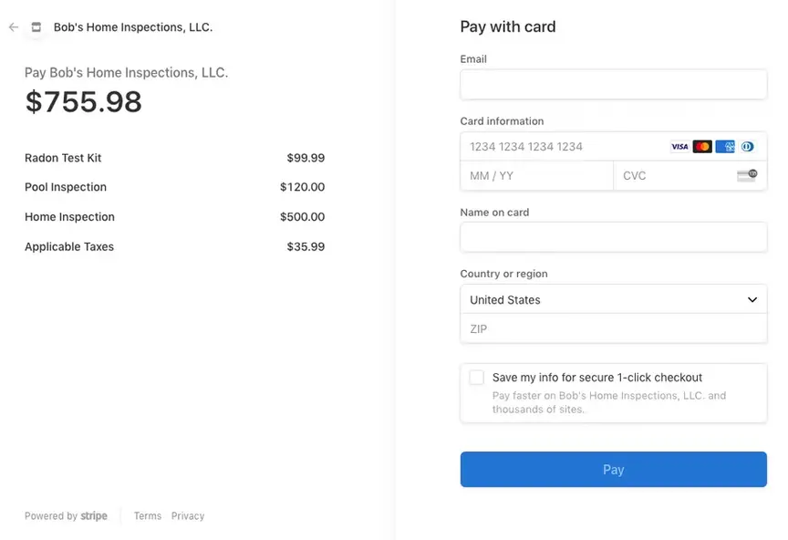

## Auto publish reports on payment

Eneris allows for the [web version](https://ener.is/presentation/2ZNdNMSZkGz3qQkSq) of the inspection report to be published automatically when a successful payment is made through Stripe.

To enable this:

1. Navigate to `Settings`.
2. Select `Presentation & PDFs`.
3. Select `Web Presentation Settings`.
4. Toggle the "Automatically Publish Report after Invoice is Settled” setting to `On`.

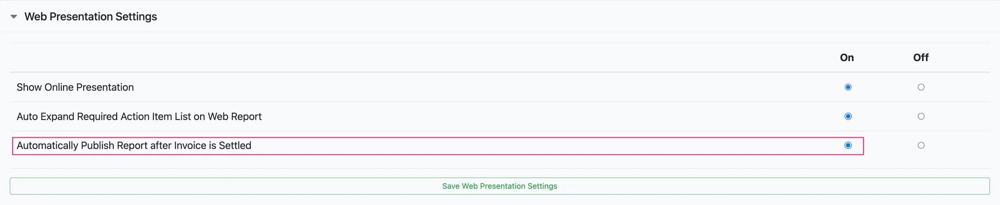

5. Select `Save Web Presentation Settings`.

## Payment collection fees

**Eneris** does not charge any payment collection fees.

**Stripe** charges a payment collection fee of 2.9% + $0.30 per transaction. Additionally, Stripe charges a separate 0.4% invoicing fee per invoice.
- e.g., On a $500 USD payment Stripe will charge (($500 * 2.9% + $0.30) + ($500 * 0.4%)) = $16.80 USD.
- [Learn more about Stripe's fees on their website](https://stripe.com/en-ca/pricing).

## Payment deposit times

The first deposit may take 8-10 days for funds to clear due to Stripe's automated fraud detection systems. After that, 2-3 days can be expected for most transactions (depending on your banking institution or whether it is a weekend/holiday).

---

## Frequently asked payment processing questions

### Can I integrate this with accounting software such as Quickbooks, Excel, etc.?

Yes. If you require a more advanced accounting workflow, Stripe offers [third-party integrations](https://marketplace.stripe.com/categories/accounting) to tie payment processing into various accounting software. It also keeps permanent records of transactions, and can export all of your transaction information as needed.

### Will Eneris have access to my clients' credit card information?

No. Credit card processing is strictly handled by Stripe, which is a Payment Card Industry (PCI) compliant transaction processor with enhanced security and fraud detection.