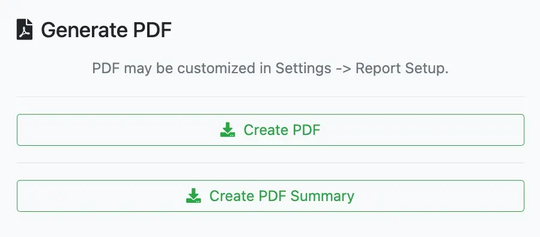
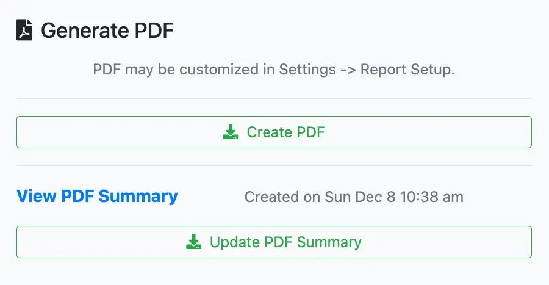
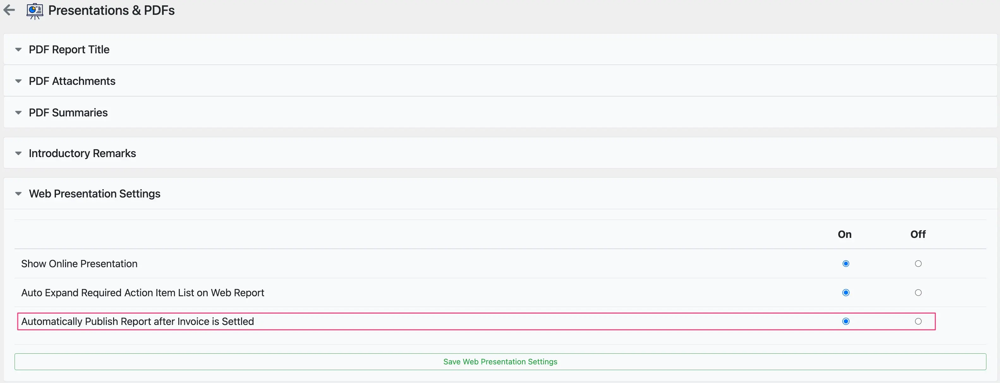
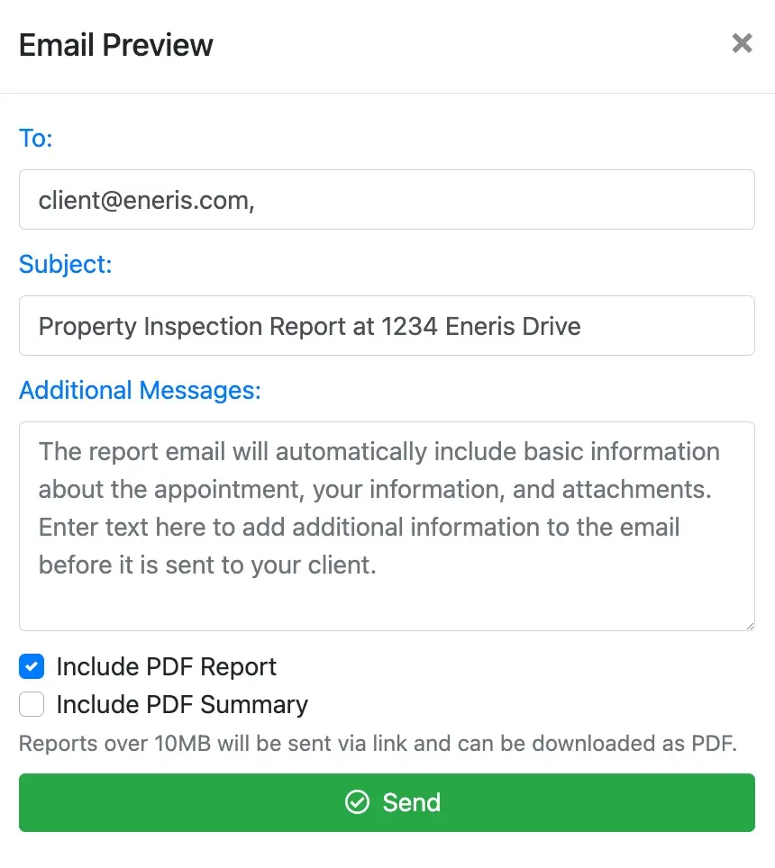

# Generate and share reports

Learn about the different options to share your finalized inspection report.

## PDF report, PDF summary, & Web report

Eneris can generate **PDF reports**, **PDF summaries**, and **web reports**.

The three options are not mutually exclusive. Feel free to generate one, two, or all three types of reports for each completed inspection.

import Tabs from '@theme/Tabs';
import TabItem from '@theme/TabItem';

<Tabs>
  <TabItem value="PDF report" label="PDF report" default>
    PDF reports are the traditional way to share a finalized inspection report with clients and other key contacts.

    :::info[Info]

    PDF reports are the full comprehensive report, which includes all inspected items even if there is no recommended action for the client.

    Use PDF reports when a full comprehensive report is requested or required by local regulations.

    :::

    ### Generate PDF reports
    1. Navigate into the desired inspection.
    2. Scroll to the bottom of the `General` tab.
    3. Select `Create PDF`.

    

    4. `View PDF Report` will appear once the PDF has been generated.

    
    
    5. The PDF report may now be shared.

    :::warning[Warning]

    This creates a PDF report based on the inspection results **at the time of the report generation**. If any changes are made to the inspection items the `Update PDF Report` button must be selected to generate a PDF report with the latest updates.

    :::
    
  </TabItem>

 <TabItem value="PDF summary" label="PDF summary">
    PDF summaries are a shortened version of the PDF report. Items in the PDF summaries have a recommended action for the client and/or a summary label was applied to the item.

    :::info[Info]

    The goal of the PDF summary is to highlight only the critical inspection information to your clients and other key contacts.

    Use PDF summaries when a shortened version of the PDF report may be beneficial to clients and other key contacts.

    :::

    ### Generate PDF summaries
    1. Navigate into the desired inspection.
    2. Scroll to the bottom of the `General` tab.
    3. Select `Create PDF Summary`.

    

    4. `View PDF Summary` will appear once the PDF has been generated.

    

    5. The PDF summary may now be shared.

    :::warning[Warning]

    This creates a PDF summary based on the inspection results **at the time of the report generation**. If any changes are made to the inspection items the `Update PDF Summary` button must be selected to generate a PDF summary with the latest updates.

    :::
  </TabItem>

  <TabItem value="Web report" label="Web report">
    Web reports offer recipients a way to access the inspection results through a webpage URL.

    :::info[Info]

    The contents of the web reports are identical to the PDF report. The web report option offers an interactive and flexible method of displaying inspection results.

    :::

        ### Generate and publish web report
    Follow the steps below to generate and publish web reports.

    1. Navigate into the desired inspection.
    2. Scroll to the bottom of the `General` tab.
    3. In the `Publish Report` section select `Publish`.

    

    4. This generates a webpage URL that you may share manually with clients and key contacts.

    

    :::info[Info]

    You may also choose to auto-publish the web report after the invoice is settled. To enable this setting, see the `Auto-publish web report` section.

    :::
    
    ### Key advantages of web reports

    Web reports offer a few key advantages over PDF reports:

    1. **Video support**: recipients can play videos taken by the inspector.
    2. **Interactive charts**: recipients can filter the pie chart and bar chart, as desired.
    3. **Higher quality images**: web reports display images with less compression (i.e., clearer images).
    4. **Image zoom**: recipients can zoom in on images.
    5. **Auto-publish web report**: inspectors may enable a setting to automatically share the web report with clients once the invoice has been settled.

    :::warning[Warning]

    Web reports may not be the preferred option by clients, or other key contacts, if a traditional document is required. In those cases, consider the PDF report and/or PDF summary instead.

    :::

    ### Auto-publish web report
    Web reports can be automatically published after the invoice is settled.

    To enable this setting, follow the steps below.
    1. Navigate to the `Settings` menu.
    2. Select `Presentations & PDFs`.
    3. Select `Web Presentation Settings`.
    4. Select `On` for the “Automatically Publish Report after Invoice is Settled” setting.

    

    5. Select `Save Web Presentation Settings`.
  </TabItem>
</Tabs>

## Share PDF report & PDF summary
Follow the steps below to share the PDF report & PDF summary with clients and key contacts.

1. Navigate into the desired inspection.
2. Scroll to the bottom of the `General` tab.
3. In the `Share Report` section select `Share by Email`.

4. The `To` and `Subject` fields will be automatically populated. Input any other notes in the `Additional Messages` field, as desired.

5. Select `Include PDF Report`, `Include PDF Summary`, or both.
6. Select `Send`.

## Share web report
Web reports may be shared by manually copying and pasting the webpage URL into any communications with your client and key contacts.

:::tip[Tip]

You may also choose to auto-publish the web report (see the “Auto-publish web report” documentation).

:::