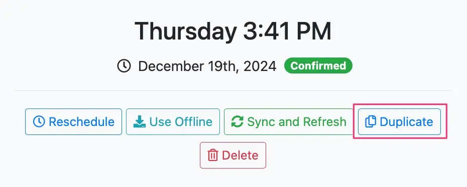
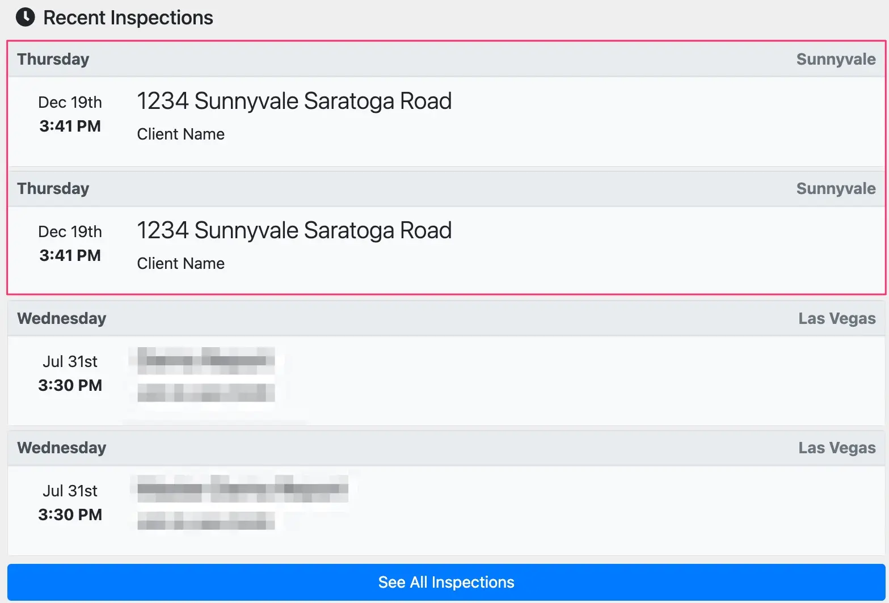

# Duplicating reports

When inspecting the same property more than once, perhaps to provide weekly renovation/development updates to your clients, you may wish to continue where you left off from the last inspection.

To do so while also retaining the original inspection report use the `Report Duplication` feature. This further simplifies your workflow by enabling you to quickly create a foundation for your recurring inspections.

## Duplicating reports

1. Navigate into the report you wish to duplicate.
2. In the **General** tab, select the `Duplicate` button underneath the inspection time.

3. Selecting the `Duplicate` button will fully duplicate the report you are currently in. All details of the report are duplicated (including the inspection date, which you may edit to the follow-up inspection date). You may need to select the `See All Inspections` button on the main dashboard page to locate the duplicated inspection report depending on the date of the original inspection.

4. You may then repurpose the duplicated report's content (e.g. inspection date, inspection name, photos, text, etc.) for the follow-up inspection.